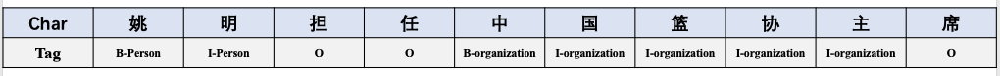
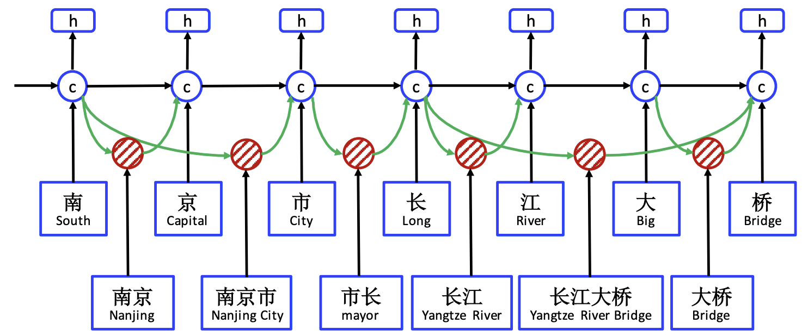
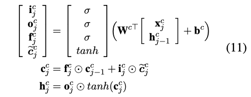
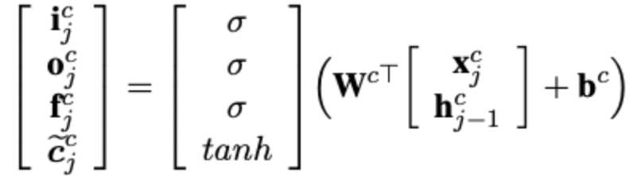
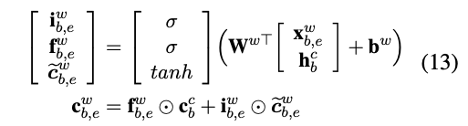
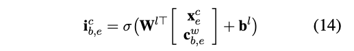
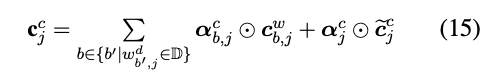
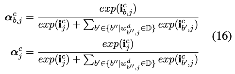
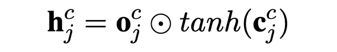

# Lattice LSTM: 解决NER中的实体词边界问题

## 1. Lattice LSTM 解决了一个什么问题

传统的基于字级别的BiLSTM+CRF实现命名实体识别(NER)，会受到实体词边界(切词)方面的影响，如图1所示。

图1 传统字符级别的NER的边界问题

可以看到，中国篮协是一个Organization，但是模型在标注的时候，将中国篮协主当成一个完整的Organization实体了。

传统的基于字级别的NER往往会存在这个问题，Lattice LSTM基于这个考虑在NER的过程中引入了词表的知识，保证模型尽可能免受这个问题的干扰。下边我们来看看它是怎么做的吧。

## 2. Lattice LSTM的原理

### 2.1 直观感受Lattice LSTM原理

图2 Lattice LSTM Structure

可以看到，总体上Lattice LSTM也是基于字级别进行的，但是它同时引入了词的信息。在每个位置的输入除了该位置的字，同时也会输入以该字结尾的所有词。

例如在"长"这个位置，此时刻的输入包含字"长"，也包含在这句话中以"长"结尾的所有词："市长 "；在最后一个位置"桥"，这个时刻的输入包含字"桥"，也包含在这句话中以"桥"结尾的所有词："大桥"，"长江大桥"。

> 这里可能有同学可能会问，这些词是怎么来的，如何去提取出一句话中的词呢?
>
> 这里其实用到了一个词典，根据词典去提取或匹配这句话中的潜在词。

这个想法是不是挺简单的，下边我们来看看，如何具体实现这个功能吧，内容涉及公式，晕公式的同学可以保持美好心情，选择性跳过。

### 2.2 Lattice LSTM严谨推理

在正式开始之前，我们先来约定一些记号：

 $x_j^c = e^c(c_j)$ 对$j$个位置的字符 $c_j$取词向量，这是字级别的向量

$x_{b,e}^w = e_{b,e}^w$ 源文本位置从 $b$ 到 $e$是一个词，对这个词取词向量，这是词级别的向量

> 如图2所示，$x_2^c$是取字"京"的字向量， $x_{1,2}^w$是取词"南京"的词向量

接下来，我们再来回顾一下基本的LSTM单元的计算公式：

好了，前情我们已经准备讨论完，下边我们进入主题。本节开始时我们提到，Lattice LSTM在每个位置引入的输入既包括字又包括词，那么具体是怎么融合的呢？

我们先来看字级别的输入处理:

字级别的输入处理和公式11中展示的相似，每个时刻的输入包括前一个时刻的隐状态 $h_{j-1}^c$ 和当前时刻的输入 $x_j^c$，根据这二者，可以算出输入门 $i_j^c$，输出门 $o_j^c$和当前时刻的输入信息$\tilde{c_j^c}$。

> 上边笔者并没有提到遗忘门 ，因为在后边字词信息融合的过程中你可以看出，根本没有用到这个门。
>
>  另外，  $h_{j-1}^c$代表前一个时刻的隐状态，但是这个隐状态是结合字和词两者的信息融合而成的，不是传统意义上的单字或单词形成的隐状态。欲知具体如何，请继续向下看。

我们再来看下词级别的输入处理:

词级别的输入处理如公式13所示，它的输入包含三部分：词向量 $x_{b,2}^w$ 和单词起始位置的字的隐状态 $h_b^c$ 和单元状态 $c_b^c$ 。整个公式的计算方式基本遵循经典的LSTM计算方式。

> **这里可能会有朋友疑问**，**为什么少了一个输出门？**
>
> 这是因为我们是对标注，而不是对词标注，所以在这里设置一个输出门没什么用。

### **最后再来看下字级别和词级别输入信息的融合**

一句话中可能被词典匹配出很多词，这里一定要理解这么多词要分别融入到哪些位置。如**图2**所示，每个词都务必融入到以该词最后一个字结尾的那个位置。

假设我们在求 $e$ 时刻的状态向量：状态向量 $c_e^c$和隐状态向量 $h_e^c$，下边来看看如何将**字和词**的信息融入到状态向量中。

上边我们计算出了词的状态向量$c_{b,e}^w$，这里不太适合将$c_{b,e}^w$的全部信息融入到$c_e^c$中，因此设置了一个**输入门** $i_{b,e}^c$来控制 $c_{b,e}^w$向$c_e^c$输入信息的多少。

从公式14可以看出，**输入门**$i_{b,e}^c$的输入信息包含两部分：状态向量$c_{b,e}^w$和该单词最后一个字对应的字向量 $x_e^c$。

前边我们提到，我们需要将以 $e$ 时刻结尾的所有词全部融入到$c_e^c$，同时还要融入当前的字信息（如公式15所示，这里融入的是字级别的输入信息$\tilde{c_e^c}$，这里假设$j=e$）

这里我们来进一步讨论一下公式15，现在我们需要向$c_e^c$，这里假设$j=e$状态向量中融入多个词信息$c_{b,e}^w$ 和1个字信息$\tilde{c_e^c}$，每个信息的融入都需要一个输入门去控制各个字或者词信息向$c_e^c$输入信息的多少， 这里对应的输入门就是公式15中的$\alpha_{b,j}^c$ 和 $\alpha_j^c$，这两者详细的计算公式进行了归一化，如下公式所示。

通过这种方式就能计算出 $e$ 时刻对应的状态向量$c_e^c$，然而我们还需要输出一个隐状态向量$h_e^c$，计算方式很简单，如公式11所示中的隐状态向量计算方式一致。

**总结一下**，上边我们完整的计算了 $e$ 时刻的状态向量：状态向量 $c_e^c$和隐状态向量$h_e^c$，其他时刻的计算方式都是一致的。在将所有时刻计算出对应的$h_j^c$后，便可将其传入CRF中进行解码序列标签。

## 3. 相关资料

[1]  [Chinese NER Using Lattice](https://arxiv.org/pdf/1805.02023.pdf) 

